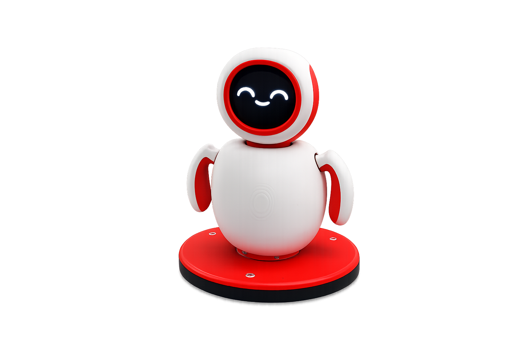

<p align="right">
  <a href="#english-version">🇬🇧 English</a> &nbsp;|&nbsp;
  <a href="#phiên-bản-tiếng-việt">🇻🇳 Tiếng Việt</a>
</p>

---

<div align="center">
  
  <h1>Nexus Server</h1>
  <p>Real-time AI voice backend for ESP32 clients — STT → LLM → TTS</p>

  
  
  
  
</div>

---

# English Version

## Overview

**Nexus Server** is a production-grade real-time voice dialogue backend designed for ESP32 devices. It bridges hardware with AI services through a high-performance streaming pipeline, providing a natural conversational voice interface for IoT devices.

**Design goals:**
- ⚡ **Ultra-low latency** — sentence-level streaming minimizes perceived response time
- 🔌 **Provider-agnostic** — swap any STT, LLM, or TTS provider without touching core logic
- 📡 **Scalable admin API** — REST endpoints for OAuth2, robot config, and user management

---

## Architecture

```
ESP32 ──► WebSocket ──► [Decode & Buffer] ──► STT ──► LLM ──► TTS ──► [Opus Encode] ──► ESP32
 (audio in)                                                                              (audio out)
```

### Processing Flow

| Step | Stage | Description |
|------|-------|-------------|
| 1 | **Audio Ingestion** | ESP32 transmits raw audio (Opus/PCM) over a persistent WebSocket connection |
| 2 | **Decode & Buffer** | Server decodes the stream and accumulates frames into a clean PCM buffer |
| 3 | **Speech-to-Text** | Buffered audio is forwarded to the configured STT provider for transcription |
| 4 | **LLM Inference** | Transcript + conversation history sent to LLM; response streamed sentence-by-sentence |
| 5 | **Text-to-Speech** | Each sentence is immediately synthesized by the TTS provider as it arrives |
| 6 | **Opus Encode & Stream** | Audio is Opus-encoded and streamed back to ESP32 in real time |

---

## Key Features

- 🎙️ **Real-time voice pipeline** — end-to-end STT → LLM → TTS with sentence-level streaming
- ⚡ **Streaming responses** — playback begins before synthesis completes, dramatically reducing perceived latency
- 🤖 **Robot management API** — REST endpoints to register, configure, and monitor devices
- 🔐 **Multi-auth support** — internal credentials + Google OAuth2 for admin panel access
- 🔄 **Provider-agnostic design** — swap STT, LLM, or TTS without touching pipeline core
- 🍪 **Session-based auth** — secure cookie sessions for the admin frontend

---

## System Requirements

| Dependency | Version | Purpose |
|------------|---------|---------|
| Python | `3.10+` | Runtime environment |
| ffmpeg | latest | Audio processing |
| libopus | latest | Opus codec (required by `opuslib`) |
| pip packages | — | See `requirements.txt` |

---

## Quick Start

```bash
# 1. Navigate to project directory
cd custom_server_xiaozhi

# 2. Install dependencies
pip install -r requirements.txt

# 3. Configure environment variables
cp .env.example .env
# Edit .env with your credentials

# 4. Launch the server
python run.py
```

Server runs at: `http://localhost:8000`

**Development mode (with auto-reload):**

```bash
uvicorn app.main:app --host 0.0.0.0 --port 8000 --reload
```

---

## Environment Configuration

Copy `.env.example` to `.env` and populate the following variables:

| Variable | Description |
|----------|-------------|
| `SESSION_SECRET` | Secret key for session encryption |
| `JWT_SECRET` | Secret key for JWT token signing |
| `SECRET_KEY` | General application secret |
| `GOOGLE_CLIENT_ID` | Google OAuth2 client ID |
| `GOOGLE_CLIENT_SECRET` | Google OAuth2 client secret |
| `OPENAI_API_KEY` | OpenAI API key (if using OpenAI as LLM/STT) |
| `LLM_PROVIDERS` | Configured LLM provider(s) |
| `ADMIN_USERNAME` | Admin panel username |
| `ADMIN_PASSWORD` | Admin panel password |

---

## Admin Interface

| Endpoint | Description |
|----------|-------------|
| `/admin/` | Admin dashboard UI |
| `/docs` | Interactive API docs (Swagger) |
| `/auth/google-login` | Google OAuth2 login |

---

## Project Structure

```
app/
├── api/            # REST routes: auth, OAuth2, robot management
├── websocket/      # Real-time WebSocket handler
├── services/       # LLM / STT / TTS pipeline services
├── database/       # SQLite connection & initialization
└── auth/           # Auth models, security helpers, CRUD

static/
├── admin/          # Admin frontend assets
└── asset/          # Images & logos

run.py              # Application entry point
requirements.txt    # Python dependencies
.env                # Environment configuration (not committed)
```

---

## License

This project is intended for internal development and integration purposes. Before any commercial release, please review the licenses of all third-party models, media assets, and external services in use.

---

<br/>

---

# Phiên Bản Tiếng Việt

## Tổng quan

**Nexus Server** là backend xử lý hội thoại giọng nói theo thời gian thực, được thiết kế dành riêng cho thiết bị ESP32. Hệ thống kết nối phần cứng với các dịch vụ AI thông qua pipeline streaming hiệu suất cao, tạo giao diện hội thoại giọng nói tự nhiên cho thiết bị IoT.

**Mục tiêu thiết kế:**
- ⚡ **Độ trễ cực thấp** — streaming theo từng câu giảm thiểu thời gian chờ cảm nhận
- 🔌 **Độc lập provider** — hoán đổi bất kỳ STT, LLM, TTS nào mà không ảnh hưởng logic lõi
- 📡 **Admin API mở rộng** — REST endpoints cho OAuth2, cấu hình robot và quản lý người dùng

---

## Kiến trúc

```
ESP32 ──► WebSocket ──► [Giải mã & Đệm] ──► STT ──► LLM ──► TTS ──► [Mã hóa Opus] ──► ESP32
(audio vào)                                                                              (audio ra)
```

### Luồng xử lý

| Bước | Giai đoạn | Mô tả |
|------|-----------|-------|
| 1 | **Nhận Audio** | ESP32 truyền audio thô (Opus/PCM) qua kết nối WebSocket liên tục |
| 2 | **Giải mã & Đệm** | Server giải mã luồng và gom các khung thành buffer PCM sạch |
| 3 | **Nhận dạng giọng nói (STT)** | Audio đã đệm được chuyển tới provider STT đã cấu hình |
| 4 | **Suy luận LLM** | Văn bản + lịch sử hội thoại gửi tới LLM; phản hồi stream theo từng câu |
| 5 | **Tổng hợp giọng nói (TTS)** | Mỗi câu lập tức được tổng hợp ngay khi nhận từ LLM |
| 6 | **Mã hóa Opus & Stream** | Audio được mã hóa Opus và stream ngược về ESP32 theo thời gian thực |

---

## Tính năng chính

- 🎙️ **Pipeline giọng nói thời gian thực** — STT → LLM → TTS đầu cuối với streaming theo câu
- ⚡ **Phản hồi streaming** — phát audio trước khi tổng hợp hoàn tất, giảm đáng kể độ trễ
- 🤖 **API quản lý robot** — REST endpoints để đăng ký, cấu hình và giám sát thiết bị
- 🔐 **Xác thực đa phương thức** — tài khoản nội bộ + Google OAuth2 cho admin panel
- 🔄 **Thiết kế độc lập provider** — thay STT, LLM, TTS mà không ảnh hưởng pipeline lõi
- 🍪 **Xác thực session** — cookie session bảo mật cho giao diện admin frontend

---

## Yêu cầu hệ thống

| Thành phần | Phiên bản | Mục đích |
|------------|-----------|---------|
| Python | `3.10+` | Môi trường chạy |
| ffmpeg | mới nhất | Xử lý audio |
| libopus | mới nhất | Codec Opus (dùng bởi `opuslib`) |
| pip packages | — | Xem `requirements.txt` |

---

## Cài đặt nhanh

```bash
# 1. Di chuyển vào thư mục dự án
cd custom_server_xiaozhi

# 2. Cài đặt dependencies
pip install -r requirements.txt

# 3. Cấu hình biến môi trường
cp .env.example .env
# Chỉnh sửa .env với thông tin của bạn

# 4. Khởi động server
python run.py
```

Server mặc định chạy tại: `http://localhost:8000`

**Môi trường phát triển (với auto-reload):**

```bash
uvicorn app.main:app --host 0.0.0.0 --port 8000 --reload
```

---

## Cấu hình môi trường

Sao chép `.env.example` thành `.env` và điền các biến sau:

| Biến | Mô tả |
|------|-------|
| `SESSION_SECRET` | Khóa bí mật mã hóa session |
| `JWT_SECRET` | Khóa bí mật ký JWT token |
| `SECRET_KEY` | Khóa bí mật chung của ứng dụng |
| `GOOGLE_CLIENT_ID` | Client ID của Google OAuth2 |
| `GOOGLE_CLIENT_SECRET` | Client Secret của Google OAuth2 |
| `OPENAI_API_KEY` | API key OpenAI (nếu dùng OpenAI làm LLM/STT) |
| `LLM_PROVIDERS` | Provider LLM được cấu hình |
| `ADMIN_USERNAME` | Tên đăng nhập admin |
| `ADMIN_PASSWORD` | Mật khẩu admin |

---

## Giao diện Admin

| Đường dẫn | Mô tả |
|-----------|-------|
| `/admin/` | Trang quản trị |
| `/docs` | Tài liệu API tương tác (Swagger) |
| `/auth/google-login` | Đăng nhập Google OAuth2 |

---

## Cấu trúc thư mục

```
app/
├── api/            # REST routes: auth, OAuth2, quản lý robot
├── websocket/      # Handler WebSocket thời gian thực
├── services/       # Pipeline LLM / STT / TTS
├── database/       # Kết nối & khởi tạo SQLite
└── auth/           # Model xác thực, bảo mật, CRUD

static/
├── admin/          # Tài nguyên frontend admin
└── asset/          # Hình ảnh & logo

run.py              # Điểm khởi chạy ứng dụng
requirements.txt    # Dependencies Python
.env                # Cấu hình môi trường (không commit)
```

---

## Giấy phép

Dự án phục vụ mục đích phát triển và tích hợp nội bộ. Vui lòng kiểm tra giấy phép của tất cả các model, media và dịch vụ bên thứ ba trước khi phát hành thương mại.

---

<p align="right"><a href="#english-version">🇬🇧 Back to English</a></p>